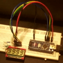

# Electrodragon's 4-digit LCD

Product link: [https://www.electrodragon.com/product/2pcs-segment-lcd-4-digit/](https://www.electrodragon.com/product/2pcs-segment-lcd-4-digit/) (select product version R2, not the bare LCD)  

This project contains example code for both AVR-libc and Arduino to drive Electrodragon's LCD equipped with the Holtek HT1621B driver.  

VLCD should be around 2 V so the 0-ohm resistor needs to be replaced with a voltage divider (or potentiometer).  

  
  
  
  
  

